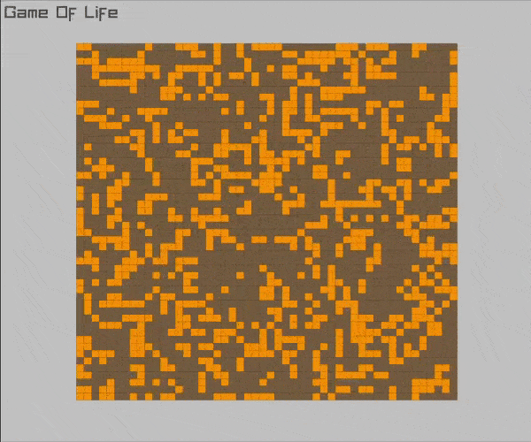

# Raylib Game Of Life


A simple Game Of Life demo written with Raylib in C++

# Demo



*50x50 map* 

# Mac Installation

1. Install raylib
    ```sh
    brew install raylib
    ```
   *Note: If you're using CLion just open the project with CLion and run, you can skip the rest*


2. Build with cmake
    ```sh
   cd raylib-game-of-life
   cmake -S . -B build
   cd build
   cmake --build .
    ```

3. Run
    ```sh
   ./game-of-life  # in build directory
    ```

# Project Structure
Main algorithm reside inside `gameOfLife.hpp`, you can call `.debugPrintBoard()` to inspect the board in console. 

`config.hpp` stores configuration like **grid count**, init population, window dimension, board dimension and game of life **update rate**.

`render.hpp` use Raylib to draw game of life 

# Ideas

- Click to add an active cell
- GUI setting
- Better Graphic